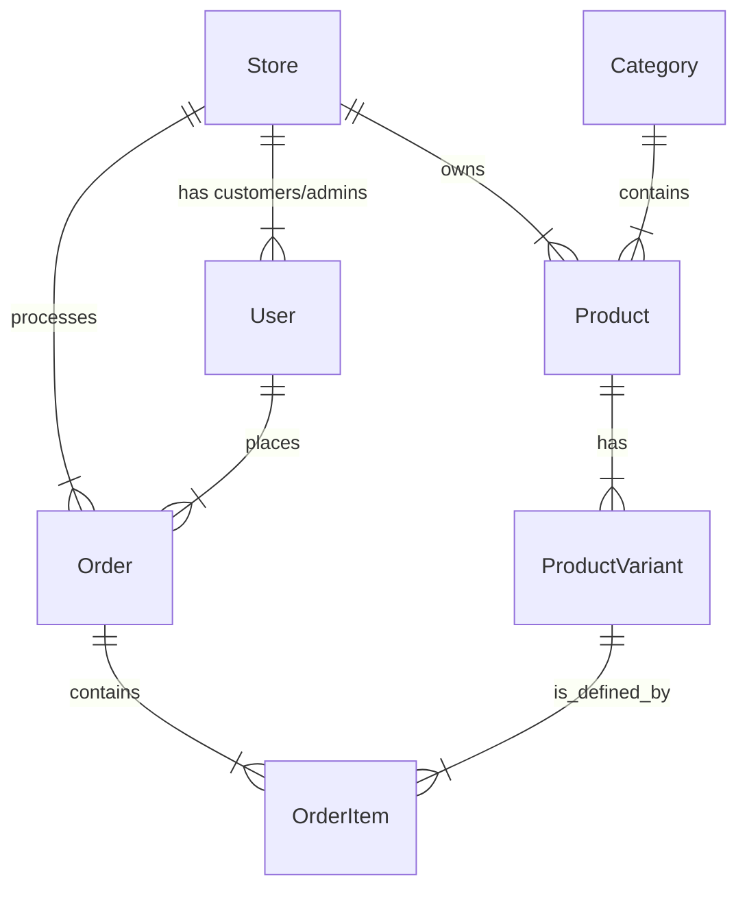

# Modern Multi-Tenant E-Commerce Implementation Plan

## 1. Project Overview & Architecture
**Goal:** Transform the current Express.js skeleton into a production-ready, multi-tenant e-commerce platform.
**Architecture:** Modular Monolith. This allows for rapid development while keeping domains (Auth, Catalog, Cart) coupled loosely enough to extract into microservices later if needed.
**Multi-Tenancy Strategy:** **Discriminator Column (Logical Separation)**.
*   Every high-level entity (Product, Order, Customer) will belong to a `Store` (Tenant).
*   Middleware will resolve the `storeId` from the request (header `x-tenant-id` or subdomain) and inject it into the request context.
*   Sequelize Scopes will be used to automatically filter queries by `storeId`.

## 2. Technology Stack
*   **Runtime:** Node.js (TypeScript)
*   **Framework:** Express.js
*   **Database:** PostgreSQL (Migrating from SQLite is required for JSONB support and concurrency).
*   **ORM:** Sequelize (Existing).
*   **Caching & Queues:** Redis (for session management, cart data, and background jobs like emails).
*   **Search Engine:** MeiliSearch or Elasticsearch (for advanced typo-tolerant product search).
*   **Storage:** AWS S3 or Cloudinary (for product images).
*   **Validation:** Joi or Zod (Input validation).
*   **Documentation:** Swagger/OpenAPI (Existing).

---

## 3. Implementation Roadmap

### Phase 1: Foundation & Multi-Tenancy (Current Focus)
*Refining the existing skeleton to support multiple stores.*

1.  **Database Migration**:
    *   Switch `config.json` to use PostgreSQL.
    *   Configure connection pooling.
2.  **Tenant Models**:
    *   Create `Store` model (name, slug, domain, settings JSON).
    *   Update `User` model to associate with `Store` (or make Users global depending on requirement - usually Store Admins are specific to a store, Platform Super Admins are global).
3.  **Tenant Middleware**:
    *   Create `resolveTenant` middleware.
    *   Extract `store_id` from subdomain or header.
    *   Handle 404 if store doesn't exist.
4.  **RBAC (Role-Based Access Control)**:
    *   Define Roles: `SUPER_ADMIN` (Platform), `STORE_ADMIN` (Merchant), `CUSTOMER`.
    *   Implement middleware to check permissions.

### Phase 2: Product Catalog & Inventory
*The core entity of the e-commerce system.*

1.  **Category Management**:
    *   Model: `Category` (id, parent_id, name, store_id).
    *   Support nested categories (Adjacency List pattern).
2.  **Product Management**:
    *   Model: `Product` (name, description, base_price, status, store_id).
    *   Model: `ProductVariant` (size, color, sku, stock_quantity, specific_price).
    *   Model: `Attribute` & `AttributeValue` (for dynamic variant generation).
3.  **Media Service**:
    *   Upload middleware (Multer).
    *   Integration with S3/Cloudinary.
    *   Associate images with Products/Variants.

### Phase 3: The Shopping Experience
*Frontend-facing features.*

1.  **Cart System**:
    *   **Strategy**: Use Redis for temporary carts (fast R/W). Persist to DB only on checkout or for logged-in users.
    *   Endpoints: `POST /cart/add`, `PATCH /cart/item/:id`, `DELETE /cart`.
2.  **Search & Filter**:
    *   Basic DB `LIKE` / `ILIKE` search initially.
    *   Advanced: Sync products to MeiliSearch for faceted search (filtering by price, brand, color instantantly).

### Phase 4: Order Management & Checkout
*The complex business logic.*

1.  **Checkout Flow**:
    *   Address Management (`Address` model).
    *   Shipping Calculation (Mock service -> Integration with ShipStation/Shippo).
2.  **Order Processing**:
    *   Model: `Order`, `OrderItem`.
    *   **State Machine**: `PENDING` -> `PAID` -> `PROCESSING` -> `SHIPPED` -> `DELIVERED` / `CANCELLED`.
    *   Database Transactions are critical here (deduct stock -> create order -> clear cart).
3.  **Payments**:
    *   Integrate **Stripe** (Intent-based API).
    *   Webhooks to handle async payment success/failure events.

### Phase 5: Advanced Features & Optimization
1.  **Background Jobs (BullMQ + Redis)**:
    *   Offload email sending (Order Confirmation, Forgot Password).
    *   Image resizing/optimization pipeline.
2.  **Analytics**:
    *   Dashboard endpoints for Store Admins (Sales over time, Top products).
3.  **Performance**:
    *   Response Caching (Redis) for public catalog pages.
    *   Database Indexing strategies.

---

## 4. Proposed Database Schema (High Level)



## 5. Directory Structure Refactoring
To support the domain-driven approach:

```
src/
├── config/
├── @types/       # Custom type definitions
├── modules/      # Modular structure
│   ├── auth/
│   ├── catalog/  # Products, Categories
│   ├── cart/
│   ├── order/
│   ├── payment/
│   └── store/    # Multi-tenancy logic
├── shared/       # Shared middleware, utils, infra services
│   ├── database/
│   ├── middlewares/
│   └── services/ # Email, S3, Logger
├── app.ts
└── server.ts
```

## 6. Testing Strategy
*   **Unit Tests**: Business logic in Services.
*   **Integration Tests**: API endpoints (Supertest) with a test database.
*   **End-to-End**: Critical flows (Checkout).

## 7. Next Immediate Steps
1.  Initialize **PostgreSQL** docker container.
2.  Create the **Store** model and migration.
3.  Refactor `User` to belong to a `Store` (or creating a linking table).
